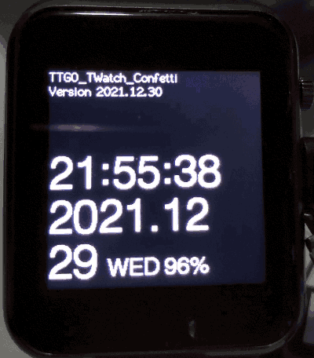
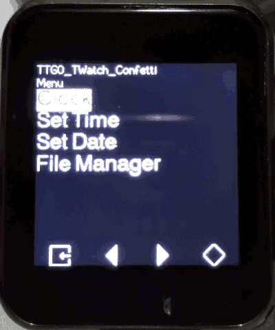
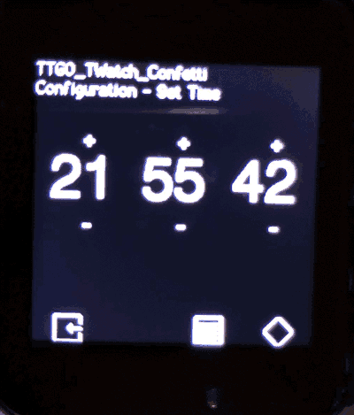

# TTGO_TWatch_Confetti

Minimal watch program for TTGO TWatch 2020

## Current status

+ Basic clock
+ Time/date settings

## Road map

+ Light level adjust
+ (WIP) SPIFFS File Manager
+ Alarm
+ WLAN
  + Sync time w/ timezone
  + Sync weather
+ Bluetooth
+ Screen lock

## Install

Download it to the device using Arduino IDE like any other TWatch examples.

## Screenshot

